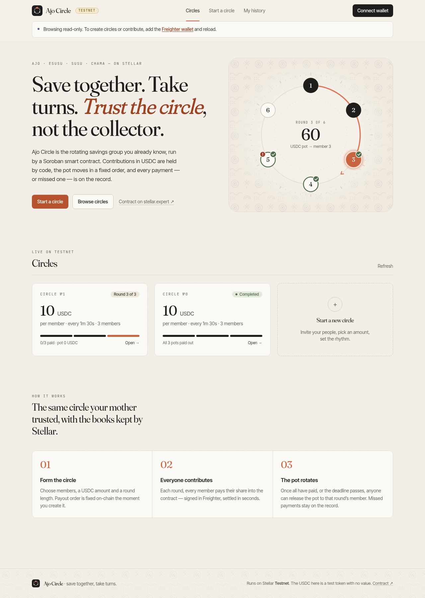
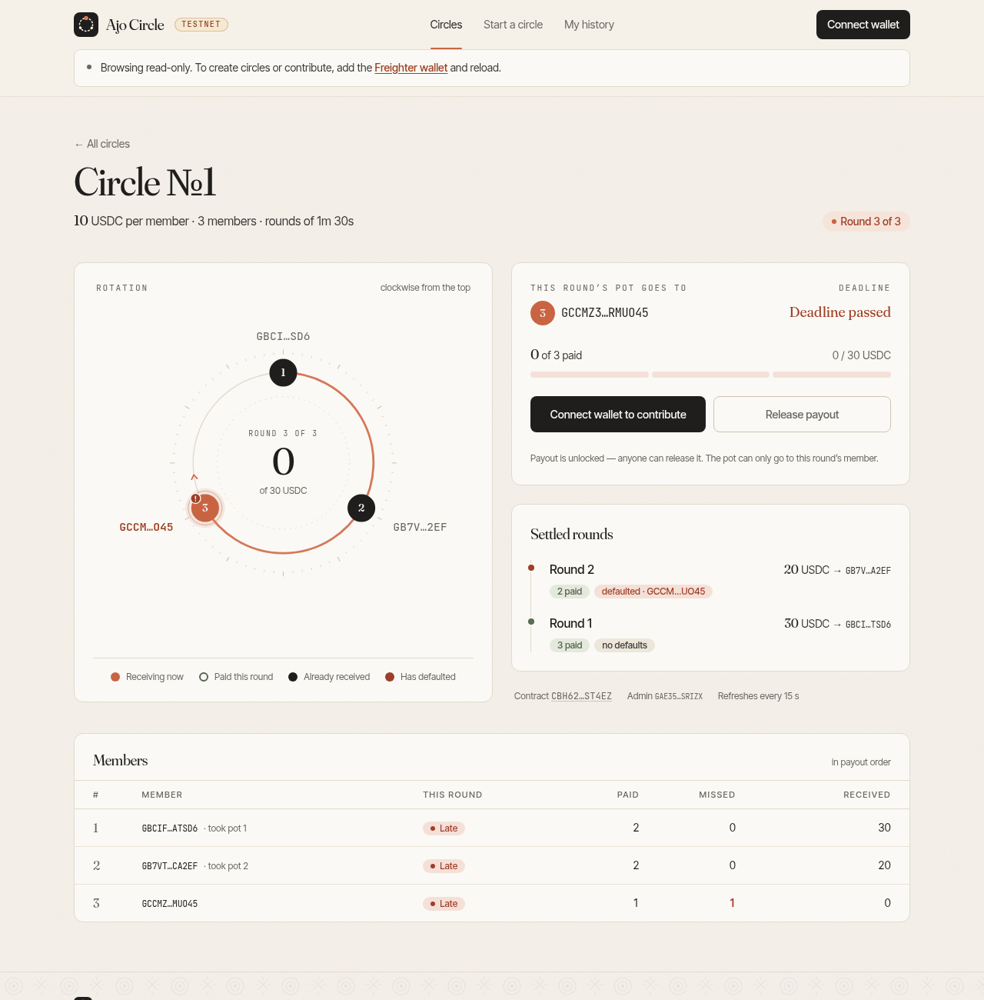
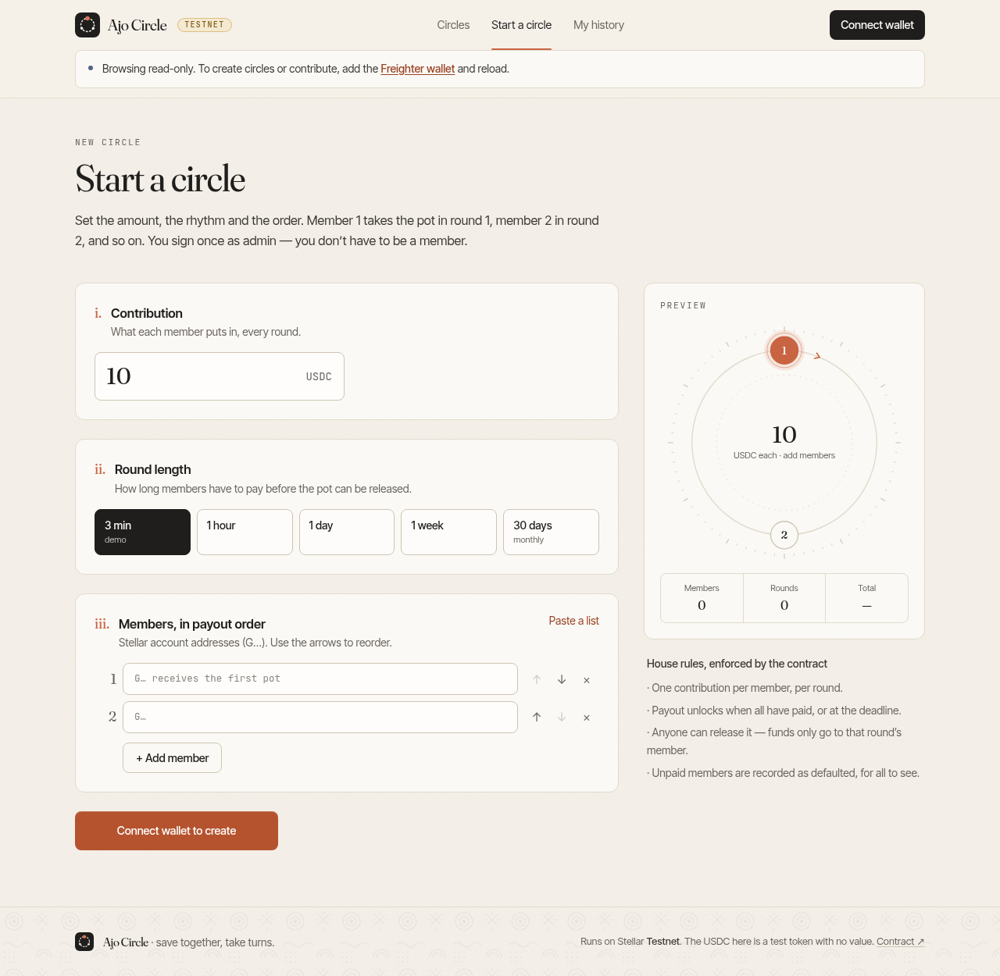
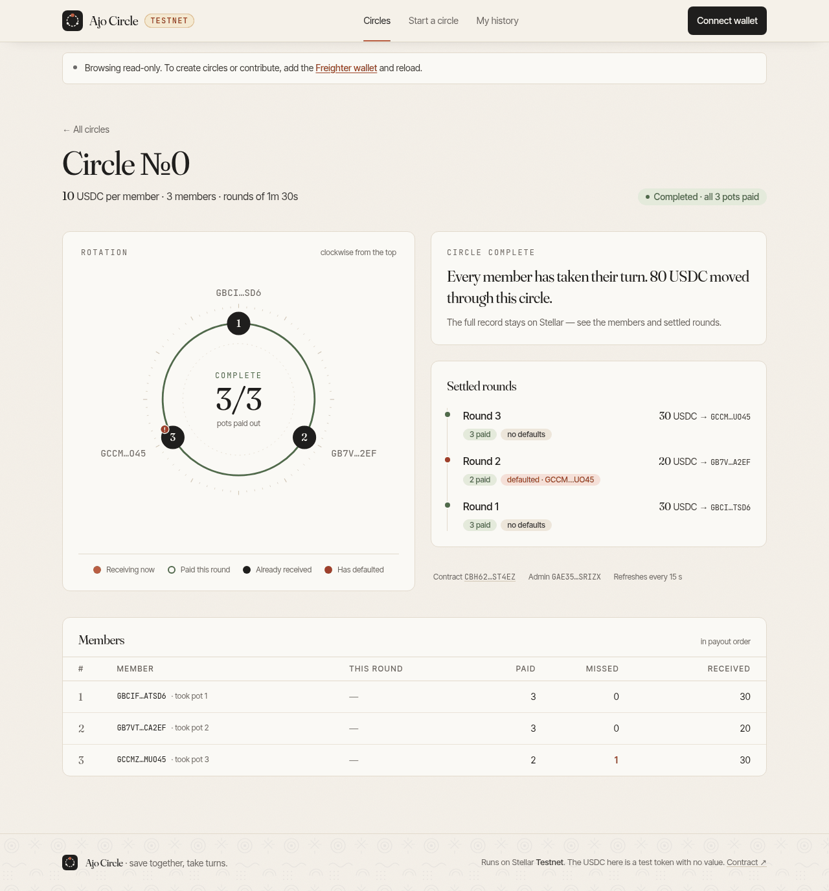
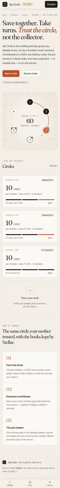
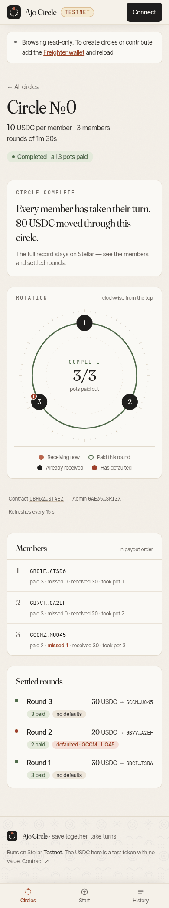
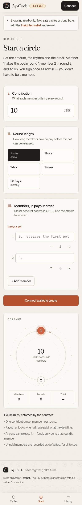

# Ajo Circle ◎

**Rotating savings groups (ajo / esusu / susu / chama) on Stellar Soroban, paid in USDC.**

Built for the Stellar **"Find Your Way"** hackathon (General Track).

> ⚠️ Everything here runs on **Stellar Testnet**. The "USDC" used in the demo is a **test asset issued by a throwaway account** and wrapped in a Stellar Asset Contract. It is **not** Circle USDC and has no value.

## Screenshots

| Home | Circle dashboard |
|---|---|
|  |  |
| **Start a circle** | **Completed circle** |
|  |  |

<p>
  
  
  
</p>

Responsive from 320 px phones to desktop: bottom tab bar on phones, actions before history on the dashboard, card lists instead of tables, ≥ 44 px tap targets and ≥ 12 px text (checked with a headless-Chrome audit at 320/360/390/430/768/1024/1280 px — no horizontal overflow on any page).

Design: warm paper palette with a clay accent and adire-indigo pattern (a nod to Yoruba resist-dyed cloth), Fraunces for headings and numbers, Inter Tight for UI, JetBrains Mono for addresses. The circle dashboard draws the group as a ring: members in payout order, the current recipient in clay, paid / already-received / defaulted marks on each seat.

---

## The problem

Across West Africa and the diaspora, tens of millions of people save through **ajo/esusu**: a group of friends, traders or co-workers each put in a fixed amount every week or month, and each round one member takes the whole pot. It is credit without a bank and savings discipline without fees.

But it runs on trust in one person — the collector (*alajo*):

- The collector can disappear with the pot, or pay friends out of order.
- Records live in a notebook or WhatsApp chat; disputes about who paid are common.
- Saving in naira means the pot loses value to inflation while you wait for your turn.
- Diaspora members can't easily join a group back home.

## How Stellar solves it

| Need | Ajo Circle on Stellar |
|---|---|
| No one should hold the pot | A **Soroban contract** escrows contributions and pays out by rule — no collector custody. |
| Stable value | Contributions are in **USDC** via the token's **Stellar Asset Contract (SAC)**, so the same asset works in classic wallets and contracts. |
| Fair, fixed order | Payout recipient is `members[round % n]`, fixed at creation. Nobody can reorder it. |
| Trustworthy records | Every contribution, payout and **missed payment (default)** is on-chain and emitted as events. |
| Group can't be stuck by one person | **Anyone** can trigger the payout once everyone has paid *or* the round deadline passes; unpaid members are recorded as defaulted. |
| Cheap & fast for small amounts | Stellar fees are fractions of a cent and finality is ~5 s — fine for ₦5,000-sized contributions. |
| Familiar wallets | Members sign with **any Stellar wallet** via Stellar Wallets Kit (Freighter, Albedo, xBull, LOBSTR, Hana, Rabet, optional WalletConnect); USDC trustlines and balances are standard Stellar. |

## Architecture

```
┌────────────────────────────┐        ┌───────────────────────────────┐
│  web/ (Next.js App Router) │        │  Stellar Testnet              │
│  - Wallets Kit connect/sign│  RPC   │  ┌─────────────────────────┐  │
│  - network/trustline/      ├───────►│  │ Ajo contract (Soroban)  │  │
│    balance checks          │        │  │  circles, rounds,       │  │
│  - create / contribute /   │        │  │  member records, events │  │
│    payout / history        │        │  └──────────┬──────────────┘  │
└──────────────┬─────────────┘        │             │ token.transfer  │
               │ Horizon (balances,   │  ┌──────────▼──────────────┐  │
               │ changeTrust)         │  │ USDC SAC (test asset)   │  │
               └─────────────────────►│  └─────────────────────────┘  │
                                      └───────────────────────────────┘
contracts/ajo   Rust, soroban-sdk 28     scripts/   stellar CLI deploy + e2e + funding
```

- **contracts/ajo** — the Soroban contract (Rust, `soroban-sdk` 28) + unit tests.
- **web** — Next.js 16 + TypeScript + Tailwind v4, `@stellar/stellar-sdk` 17 and `@creit.tech/stellar-wallets-kit` 2.7. Reads use RPC simulation; writes are built → `prepareTransaction` → signed in the connected wallet (`StellarWalletsKit.signTransaction` with the testnet passphrase and address) → submitted → polled. No secrets in the frontend; all config is `NEXT_PUBLIC_*` public IDs.
- **scripts** — `stellar` CLI scripts to deploy to testnet, run an end-to-end cycle, and fund a demo wallet with test USDC.

## Contract API

All amounts are `i128` in the token's smallest unit (USDC has 7 decimals: `10 USDC = 100000000`).

| Function | Who | Description |
|---|---|---|
| `create_circle(admin, token, contribution: i128, members: Vec<Address>, period_secs: u64) -> u32` | admin (auth) | Validates ≥2 unique members (max 50), `contribution > 0`, `period_secs > 0`. Round 0 starts now. Returns the circle id. |
| `contribute(circle_id, member)` | member (auth) | Must be a member, once per round. Transfers `contribution` from member to the contract. Late payments are accepted until someone calls `payout`. |
| `payout(circle_id) -> i128` | anyone | Allowed when all members paid **or** `now >= round_start + period_secs`. Sends the pot to `members[round % n]`, records unpaid members as defaulted, advances the round (new deadline from now). After `n` rounds the circle is `Completed`. |
| `get_circle(circle_id) -> Circle` | view | Admin, token, contribution, members, period, round, round_start, status, paid list, pot. |
| `get_round_status(circle_id, round) -> RoundStatus` | view | recipient, deadline, paid, unpaid, defaulted, pot, settled, payout_ready. Current round is computed live; past rounds come from stored history. |
| `get_member_record(circle_id, member) -> MemberRecord` | view | `paid`, `missed`, `received`, `missed_rounds`. |
| `circle_count() -> u32` | view | Circles are numbered `0..count`. |

**Errors** (`Error(Contract, #n)`): 1 TooFewMembers · 2 DuplicateMember · 3 InvalidContribution · 4 InvalidPeriod · 5 CircleNotFound · 6 NotMember · 7 AlreadyContributed · 8 PayoutNotReady · 9 CircleClosed · 10 TooManyMembers · 11 RoundNotFound.

**Events** (`#[contractevent]`): `circle_created`, `contributed`, `paid_out` (includes the defaulted list), `circle_completed`.

**Storage & TTL**: the circle counter lives in instance storage (extended to ~30 days on every write). Circles, settled rounds and member records live in persistent storage and are extended to ~90 days whenever they are read or written (threshold ~60 days), so active circles never expire. A circle idle for >90 days would need a TTL extension/restore (`stellar contract extend` / `restore`) before use.

### Unit tests

`cargo test` (10 tests): full happy cycle (3 rounds, balances net to zero, auth tree checked), duplicate contribution, non-member, unknown circle, payout before ready, default after period (ledger time advanced; also a round where nobody pays), closure after final round, invalid create params (too few / duplicates / zero & negative contribution / zero period / too many), admin auth required, independent circles.

## Testnet deployment

| | ID |
|---|---|
| Ajo contract | [`CBH6266NK6UGOLQ6NEUWM7EYANTMHOB5CLCJ27LZ3ARAARP52CIST4EZ`](https://stellar.expert/explorer/testnet/contract/CBH6266NK6UGOLQ6NEUWM7EYANTMHOB5CLCJ27LZ3ARAARP52CIST4EZ) |
| Test USDC SAC | [`CATRFP36R3S26TGC2W5VQKV7ZFWKQ2B2HAJI6RXUTSB442UBTPJDO5MB`](https://stellar.expert/explorer/testnet/contract/CATRFP36R3S26TGC2W5VQKV7ZFWKQ2B2HAJI6RXUTSB442UBTPJDO5MB) |
| Test asset | `USDC:GDV2MVS4BPWM7E2MHVVPLEVYJL2EMOSHZEAK4OV4YYTPSAQ4QFV3NDAA` (throwaway testnet issuer) |
| Wasm hash | `14344fb9e8babb38125ec05389e701a0de5c5e8015dd38630539688fd5c443dc` |

Deployment transactions: [SAC deploy](https://stellar.expert/explorer/testnet/tx/1b1107616562431a86af863a4bae8c81ac03874922f468e9fc19d82e27b19835) · [wasm upload](https://stellar.expert/explorer/testnet/tx/1dd5ad4930f988ae1ad6b7f41f21d501e4058081d46d758e5275bda76840b9af) · [contract deploy](https://stellar.expert/explorer/testnet/tx/2df4a46948d25baf720b44c5fff5d93eaef5ae05e5c1b0837f9b0c5809aee996)

### End-to-end run — circle #0 (3 members, 10 USDC, 90 s rounds, ran to completion)

| Step | Tx |
|---|---|
| create_circle | [f10b1496…](https://stellar.expert/explorer/testnet/tx/f10b1496e998c196f43d4a779215141ce00b80e3161e21f8fe74e6dcb24c59e6) |
| Round 1 — m1, m2, m3 contribute | [95f23667…](https://stellar.expert/explorer/testnet/tx/95f23667e67154630c189f3d990f31ec17cf532a9fb7f8366db3aaf9589a1bce) · [750ea01c…](https://stellar.expert/explorer/testnet/tx/750ea01c90eed261529eab0823881497960a3b632c178774606d52f770294caf) · [8b46db45…](https://stellar.expert/explorer/testnet/tx/8b46db45c1ba82c99413546a7059db958c62cb6f52daa16b9aaac5f84ad78bf0) |
| Round 1 payout → m1 (30 USDC, before deadline) | [73dab340…](https://stellar.expert/explorer/testnet/tx/73dab340465ffb14df12009f38fcb3507d439e3efcac295237ddb79717ba1447) |
| Round 2 — m1, m2 contribute (m3 skips) | [054f4511…](https://stellar.expert/explorer/testnet/tx/054f451187de99c23b8a1b19918e3c4c14371be37cd08936b15349a35a032101) · [4223c456…](https://stellar.expert/explorer/testnet/tx/4223c4560afec65199b83d9a14245fc0414154f22beadcb8f3867532a5791b81) |
| Early payout attempt | rejected by simulation with `PayoutNotReady` (#8) |
| Round 2 payout after deadline → m2 (20 USDC), **m3 recorded as defaulted** | [4ea19002…](https://stellar.expert/explorer/testnet/tx/4ea1900261176a50e77bb2b16e3f050aa82f90a073c96c13d7a3dbba2508e08e) |
| Round 3 — m1, m2, m3 contribute | [a5b5d282…](https://stellar.expert/explorer/testnet/tx/a5b5d282e413bc9065d9917d8be2465c853b4cf4b705b48ce94f1a6ac29374c4) · [adc9ce93…](https://stellar.expert/explorer/testnet/tx/adc9ce938a44cbcb3fd4a40755217174b2ad8a985c87e5d7e855db7931dd47a8) · [2807a6f4…](https://stellar.expert/explorer/testnet/tx/2807a6f492a227234e2f0c2c321d3f1e9c6301d504e2ff66f3b7889ad0446f99) |
| Round 3 payout → m3 (30 USDC) — **circle Completed** | [61c2172e…](https://stellar.expert/explorer/testnet/tx/61c2172ea36eb5feb99cdfb0f073916d989bbdf934fd9f0fdfdae297543453a4) |

A second scripted run (circle #1, with on-chain JSON state dumps) is in [`deployments/testnet-e2e.md`](deployments/testnet-e2e.md).

## Wallets

The web app uses **[Stellar Wallets Kit](https://stellarwalletskit.dev/)** (`@creit.tech/stellar-wallets-kit` 2.7.0) — one *Connect wallet* button opens the kit's picker, themed to match the app.

| Wallet | Type | Notes |
|---|---|---|
| Freighter | extension / mobile | Listed first among wallets; reports its network, so the app shows a **Wrong network** banner and follows account switches. |
| Albedo | web (no install) | Opens an albedo.link popup — the zero-install option for judges and new users. |
| xBull | extension / PWA | |
| LOBSTR | extension | |
| Hana | extension | |
| Rabet | extension | |
| WalletConnect | mobile wallets via QR | **Optional** — only enabled when `NEXT_PUBLIC_WALLETCONNECT_PROJECT_ID` is set (free project id from [Reown Cloud](https://cloud.reown.com)); rebuild after setting it. |

- The picker lists installed/available wallets first (most recently used on top), then the rest with an *Install* link.
- The chosen wallet and address are remembered (the kit's `localStorage` keys) and restored on reload; the header chip shows wallet name + short address with **Copy address**, **Switch wallet** and **Disconnect**.
- Every transaction is signed with the Testnet passphrase from `NEXT_PUBLIC_NETWORK_PASSPHRASE`. Only Freighter exposes its current network; for other wallets the app can't detect a mismatch, so it reminds you to keep the wallet on Testnet.
- **Freighter mobile (in-app browser):** Freighter's mobile app does not inject a signing API into its dApp browser — it only sets a marker, `window.stellar = { provider: "freighter", platform: "mobile" }`, and talks to dApps exclusively over **WalletConnect** ([WebViewContainer.tsx](https://github.com/stellar/freighter-mobile/blob/401fcfea8e3662961d5b0346bb916dea3d99d764/src/components/screens/DiscoveryScreen/components/WebViewContainer.tsx#L339-L345)). The kit's Freighter module therefore reports itself unavailable there and expects its WalletConnect module to take over ([freighter.module.ts](https://github.com/Creit-Tech/Stellar-Wallets-Kit/blob/7663331fd6e8d192653deb08ae93fd0c224b42a8/src/sdk/modules/freighter.module.ts#L42-L44), [wallet-connect.module.ts](https://github.com/Creit-Tech/Stellar-Wallets-Kit/blob/7663331fd6e8d192653deb08ae93fd0c224b42a8/src/sdk/modules/wallet-connect.module.ts#L82-L92)). So:
  - **To support Freighter mobile, set `NEXT_PUBLIC_WALLETCONNECT_PROJECT_ID`** (free at [cloud.reown.com](https://cloud.reown.com) → create a project → copy the Project ID; add your site's domain, e.g. `your-app.vercel.app`, to the project's allowed domains). On Vercel: *Project → Settings → Environment Variables*, then **redeploy** (the value is inlined at build time). Inside Freighter's browser, *Connect wallet* then opens the WalletConnect sheet — pick **Freighter** to approve the connection in the app.
  - Without it, the app detects Freighter's in-app browser, explains why it can't connect there and offers **Connect with Albedo** instead — it never shows an "Install Freighter" prompt. In any wallet in-app browser, extension-only wallets and *Install* labels are hidden from the picker.
- The kit is loaded with dynamic `import()` on the client only (SSR-safe). Without a WalletConnect project id, `next.config.ts` aliases the kit's WalletConnect module to a stub so the Reown/WalletConnect bundle is never shipped.

## Run it

### Prerequisites

- **Rust** ≥ 1.84 with the `wasm32v1-none` target, and **Stellar CLI** 28.x ([docs](https://developers.stellar.org/docs/build/smart-contracts/getting-started/setup))
- **Node.js ≥ 22.12** (required by `@stellar/stellar-sdk` 17)
- A Stellar wallet on **Testnet** — e.g. the **Freighter** extension (Settings → Network → Testnet), or **Albedo** in the browser with nothing to install (see [Wallets](#wallets))

### Windows (PowerShell)

```powershell
# one-time toolchain
winget install --id Rustlang.Rustup        # or rustup-init.exe from rustup.rs; needs VS C++ Build Tools
rustup target add wasm32v1-none
winget install --id Stellar.StellarCLI --version 28.1.0
winget install OpenJS.NodeJS.LTS           # Node 22.12+ / 24

git clone <repo-url> ajo-circle; cd ajo-circle

# contract: test + build
cargo test
stellar contract build

# web app (uses the deployed testnet IDs from .env.example)
cd web
Copy-Item .env.example .env.local
npm install
npm run dev      # http://localhost:3000
```

Deploy your own copy and fund a wallet (optional):

```powershell
Set-ExecutionPolicy -Scope Process Bypass        # allow local scripts for this session
.\scripts\deploy-testnet.ps1                     # creates ajo-admin / ajo-issuer identities, deploys token SAC + contract
# copy the printed IDs into web\.env.local (NEXT_PUBLIC_*), then:
.\scripts\fund-test-usdc.ps1 -Destination G...YOUR_WALLET_ADDRESS -Amount 500
```

### Linux / macOS (bash)

```bash
curl --proto '=https' --tlsv1.2 -sSf https://sh.rustup.rs | sh
rustup target add wasm32v1-none
curl -fsSL https://github.com/stellar/stellar-cli/raw/main/install.sh | sh

cargo test && stellar contract build
cd web && cp .env.example .env.local && npm install && npm run dev

# optional: own deployment + scripted end-to-end cycle
./scripts/deploy-testnet.sh
./scripts/e2e-testnet.sh                       # 3 members, all pay, payout, then a default round
./scripts/fund-test-usdc.sh G...YOUR_WALLET_ADDRESS 500
```

> The test-USDC issuer key lives only in the stellar CLI config of the machine that ran the deploy script (default `~/.config/stellar`; list identities with `stellar keys ls`). `fund-test-usdc` must run on that machine. To use the IDs in this README you need the original deployer to fund you, or run your own deploy and update `web/.env.local`.

## Demo walkthrough (≈3 min)

1. **Setup** (before recording): three testnet wallet accounts (A, B, C) — e.g. Freighter accounts, or Albedo. For each: open the app → *Fund with Friendbot* (if new) → *Add USDC trustline* → run `fund-test-usdc` for its address.
2. **Create** (A): *Create* → 10 USDC, round length *3 minutes (demo)*, paste A, B, C → *Create circle* → sign in your wallet → open the dashboard.
3. **Contribute**: as A, B and C, press *Contribute 10 USDC* (switch account in Freighter — the page follows — or use *Switch wallet* in the header). Watch the paid bar and pot fill.
4. **Payout**: all paid → *Trigger payout* is unlocked → anyone presses it → 30 USDC lands with A; open the explorer link.
5. **Default**: next round, only A and B pay. Show *Payout locked* + the countdown. When it hits zero, trigger payout → B gets 20 USDC, **C is marked defaulted** in *Settled rounds* and in *My history*.
6. Show the contract and events on stellar.expert; mention the CLI e2e record and unit tests.

Error states worth showing: Freighter on Mainnet → red *Wrong network* banner; account without trustline → *Missing trustline* + one-click fix; insufficient USDC → *Low balance* message before signing.

## Limitations & next steps

- **No collateral / penalties yet**: a member who defaults still receives their pot when it's their turn. Next: stake-based collateral, slashing defaulted members' payouts, or reordering defaulters to the end.
- Member list and order are fixed at creation; no invites/acceptance flow, no mid-circle replacement.
- Late contributions are accepted until someone calls `payout`; the deadline is "payout unlocks", not "contributions close".
- Testnet only, unaudited. Mainnet would use Circle's USDC SAC and an audit.
- Listing circles reads every circle (fine for a demo; an indexer over contract events would scale better).

## License

[MIT](LICENSE)
